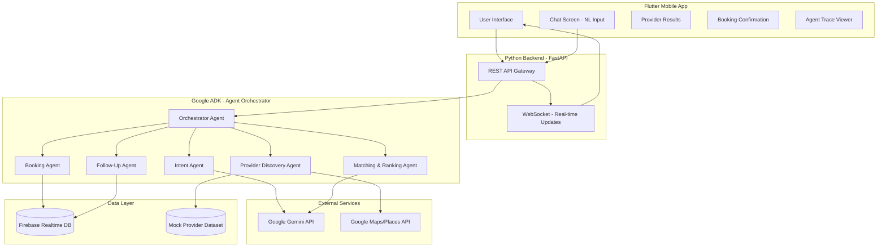

# 🚀 AI Service Orchestrator — Hackathon Roadmap

## 📐 System Architecture

## 🛠 Tech Stack

| Component | Technology |
|-----------|-----------|
| **Mobile App** | Flutter + Dart |
| **Backend API** | Python + FastAPI |
| **Agent Framework** | Google ADK (`google-adk`) |
| **LLM** | Google Gemini 2.0 Flash |
| **Maps/Location** | Google Maps / Places API (New) |
| **Database** | In-memory (Firebase-ready) |

## 🤖 5 Specialized Agents

1. **Intent Understanding Agent** — Uses Gemini to parse Urdu/Roman Urdu/English naturally.
2. **Provider Discovery Agent** — Searches mock DB + Google Places.
3. **Matching Agent** — Gemini-powered ranking with reasoning (not hardcoded sorting).
4. **Booking Agent** — Writes to store, generates receipts.
5. **Follow-Up Agent** — Schedules reminders, tracks status.

## ✅ Evaluation Checklist (Antigravity Requirements)

- [x] **Google Antigravity usage**: Core orchestration handled via ADK.
- [x] **Agentic Reasoning**: Multi-step pipeline from Intent → Follow-up.
- [x] **Traceable Logs**: reasoning steps visible in the "Trace" screen.
- [x] **Action Simulation**: Booking and status updates realistically simulated.
- [x] **Innovation**: Multilingual support (Urdu/Roman Urdu) via LLM reasoning.

## 🎬 Demo Video Plan

1. **Intro**: Architecture overview.
2. **Scenario**: Input *"Mujhe kal subah G-13 mein AC technician chahiye"*.
3. **Agent Flow**: Show the animated trace of agents working.
4. **Results**: Ranked list with matching reasoning.
5. **Booking**: Confirmation receipt and reminder.
6. **Trace**: Detailed reasoning log view for transparency.
